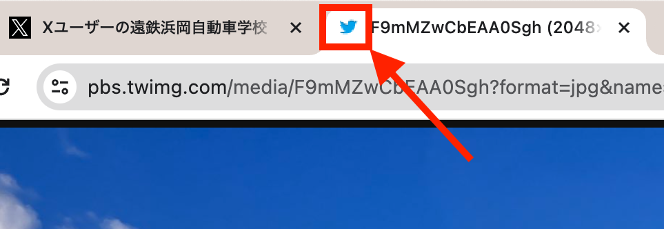

# munou-chat

いにしえの人工無能（人工無脳）っぽいチャットを、あえて Embeddings と Vector store だけで再現してみました。

- Embeddings : Amazon Bedrock の Titan Embeddings G1 - Text
- Vector store : pgvector 0.5.1（PostgreSQL 15）

※ Cloud9 で実行

## Bedrock モデル有効化



## IAM Role（追加分）

```json:
{
    "Version": "2012-10-17",
    "Statement": [
        {
            "Effect": "Allow",
            "Action": "bedrock:*",
            "Resource": "*"
        }
    ]
}
```

## pgvector コンテナ起動

```sh:
docker pull ankane/pgvector
docker run --net=host -e POSTGRES_PASSWORD='【パスワード】' ankane/pgvector
```

## pip

```sh:
pip install streamlit
pip install boto3 langchain
pip install pgvector psycopg2-binary
pip install python-dotenv
```

または

```sh:
pip install -r requirements.txt
```

## .env ファイル

```text:
PGVECTOR_DRIVER=psycopg2
PGVECTOR_HOST=localhost
PGVECTOR_PORT=5432
PGVECTOR_DATABASE=postgres
PGVECTOR_USER=postgres
PGVECTOR_PASSWORD=【pgvectorコンテナ起動時に指定したパスワード】
```

## 起動

```sh:
streamlit run app.py --server.port 8080
```