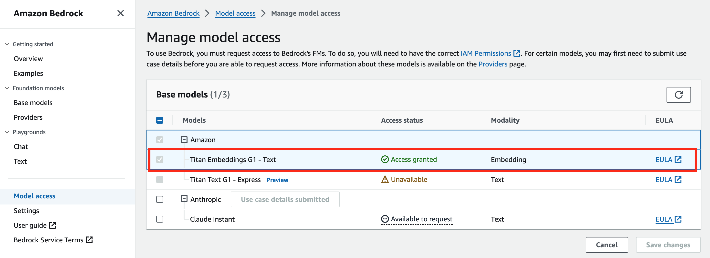

# munou-chat

## pip

```sh:
pip install streamlit
pip install boto3 langchain
pip install pgvector psycopg2-binary
pip install python-dotenv
```

## IAM Role（追加分）

```json:
{
    "Version": "2012-10-17",
    "Statement": [
        {
            "Effect": "Allow",
            "Action": "bedrock:*",
            "Resource": "*"
        }
    ]
}
```

## Bedrock モデル有効化

